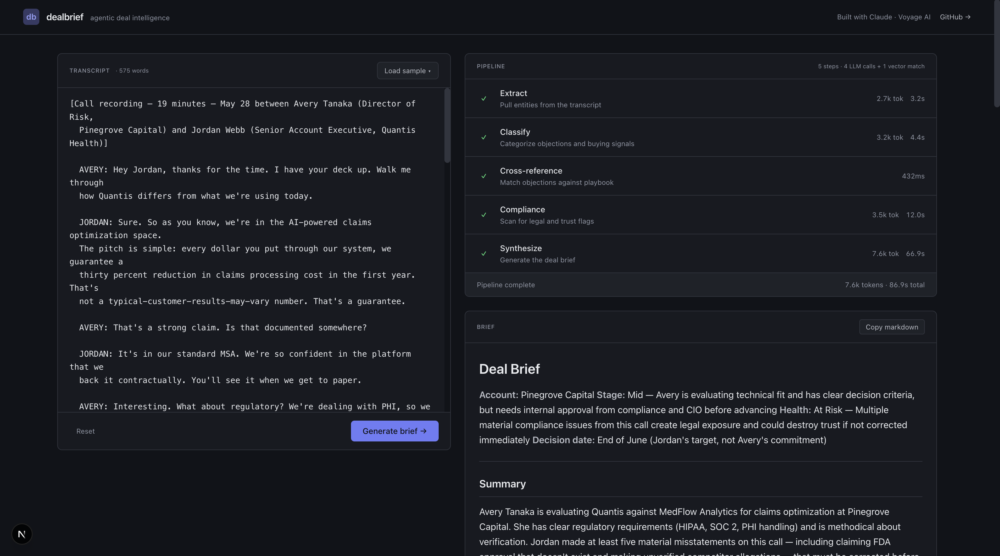

# dealbrief

**Agentic deal intelligence for sales calls.** Paste a transcript, get a structured deal brief in under a minute: stakeholders mapped, objections classified and matched against a sales playbook, compliance landmines flagged, and a follow-up email drafted — streamed to the screen as the pipeline runs.

🔗 **Live demo:** [dealbrief-codejupiters-projects.vercel.app](https://dealbrief-codejupiters-projects.vercel.app)
🎥 **30-second walkthrough:** _(Loom embed — coming soon)_



---

## Why this exists

LLM wrappers that take a transcript and call `summarize()` once are a dime a dozen. Real sales operations need something more structured: who's on the call, what they're objecting to, whether your AE just promised something legal is going to flag, and what to do tomorrow morning.

dealbrief is a five-step agentic pipeline that treats a sales call as a structured intelligence problem. Each step has a narrow job and produces typed output the next step can consume. The final synthesis sees everything and writes a brief a sales manager could hand a rep.

---

## Architecture

```
┌─────────────────────────────────────────────────────────────────────┐
│                          TRANSCRIPT INPUT                            │
└──────────────────────────────────┬──────────────────────────────────┘
                                   │
        ┌──────────────────────────┼──────────────────────────┐
        ▼                          ▼                          ▼
  ┌───────────┐              ┌───────────┐              ┌────────────┐
  │  EXTRACT  │              │ CLASSIFY  │              │ COMPLIANCE │
  │           │              │           │              │            │
  │  Haiku    │              │  Haiku    │              │   Haiku    │
  │           │              │           │              │            │
  │  People,  │              │ Objection │              │ Unsupported│
  │ companies,│              │ categories│              │   claims,  │
  │ products, │              │ + buying  │              │  PII risks,│
  │  amounts, │              │  signals  │              │ regulatory │
  │  timeline │              │           │              │  promises  │
  └─────┬─────┘              └─────┬─────┘              └─────┬──────┘
        │                          │                          │
        │                          ▼                          │
        │                  ┌───────────────┐                  │
        │                  │ CROSS-REFERENCE│                  │
        │                  │                │                  │
        │                  │ Voyage AI       │                  │
        │                  │ embeddings      │                  │
        │                  │                │                  │
        │                  │ Match objections│                  │
        │                  │ against 12-entry│                  │
        │                  │ sales playbook  │                  │
        │                  └───────┬────────┘                  │
        │                          │                          │
        └──────────────────────────┼──────────────────────────┘
                                   ▼
                          ┌────────────────┐
                          │   SYNTHESIZE   │
                          │                │
                          │     Sonnet     │
                          │                │
                          │ Streaming      │
                          │ markdown brief │
                          │ + draft email  │
                          └────────┬───────┘
                                   │
                                   ▼
                          ┌────────────────┐
                          │   DEAL BRIEF   │
                          │                │
                          │  Stakeholders  │
                          │   Objections   │
                          │ Buying signals │
                          │   Compliance   │
                          │  Next actions  │
                          │ Follow-up email│
                          └────────────────┘
```

### The five steps

| Step | Model | Job | Output type |
|---|---|---|---|
| **1. Extract** | Claude Haiku | Pull structured entities from raw transcript | People, companies, amounts, dates, products, decision criteria, timeline signals |
| **2. Classify** | Claude Haiku | Categorize objections into a closed enum + surface buying signals | `price \| timing \| technical \| political \| competitor \| trust \| other` + severity + confidence |
| **3. Cross-reference** | Voyage AI `voyage-3-lite` | Match each objection summary against a hardcoded sales playbook via cosine similarity | Top-3 playbook patterns + recommended responses |
| **4. Compliance** | Claude Haiku | Conservative scan for legal/trust landmines | Unsupported claims, certification misstatements, regulatory promises, PII commitments, competitor disparagement |
| **5. Synthesize** | Claude Sonnet | Take everything above and write a senior-level deal brief | Streaming markdown — stakeholder map, top objections with responses, compliance flags, next actions, draft email |

### Design decisions worth flagging

**Why three Haiku calls and one Sonnet?** Haiku is fast and structured — `generateObject` with Zod schemas gives you typed, validated entities for cents per call. Sonnet only runs on the synthesis step where prose quality actually matters. The full pipeline costs roughly $0.02 per transcript.

**Why embeddings instead of an LLM for cross-referencing?** A playbook lookup is a similarity search, not a reasoning task. Calling an LLM to do "which of these 12 patterns matches" is overkill that adds 2–5 seconds of latency. Voyage AI's `voyage-3-lite` returns matches in ~500ms with a direct `fetch` to their API (the `voyageai` npm SDK has Turbopack bundling issues, so it's a thin custom client).

**Why streaming?** The synthesis step takes 30–70 seconds depending on transcript length. Streaming token-by-token over SSE means the brief starts appearing within ~2 seconds of synthesis starting. The UI feels alive instead of frozen.

**Why a closed enum for objection categories?** Open-ended classification produces inconsistent labels across runs. A closed set lets you build dashboards on top and compare deals at scale — which is what a real sales ops team would need.

**Compliance bias toward flagging.** Better to over-flag and have a rep ignore than miss an FDA misstatement that kills a deal during legal review. The compliance step has explicit prompts to err on the side of caution.

---

## Tech stack

- **Next.js 15** (App Router, Turbopack)
- **TypeScript** end-to-end with **Zod** for runtime schema validation
- **Anthropic Claude** — Haiku for extraction/classification/compliance, Sonnet for synthesis
- **Voyage AI** — `voyage-3-lite` embeddings for playbook cross-referencing
- **Vercel AI SDK** — `generateObject` for structured output, `streamText` for synthesis
- **Tailwind CSS** with custom HSL design tokens for the dark theme
- **react-markdown** for rendering the streaming brief
- **Server-Sent Events** for streaming the pipeline state and brief tokens to the client

---

## Running locally

```bash
git clone https://github.com/codejupiter/dealbrief.git
cd dealbrief
npm install
```

Create `.env.local`:

```bash
ANTHROPIC_API_KEY=sk-ant-...
VOYAGE_API_KEY=pa-...
```

Then:

```bash
npm run dev
```

Open [localhost:3000](http://localhost:3000), click **Load sample**, and pick one of the three included transcripts:

- **Price objection** — Mid-stage deal with a planted ROI claim that the compliance step should catch
- **Easy close** — Clean call with strong buying signals, no objections
- **Compliance landmine** — Healthtech sale where the rep makes an FDA misstatement, disparages a competitor without evidence, and promises PHI handling that conflicts with their actual product

The compliance landmine is the most interesting one — the synthesis step's draft email proactively corrects the FDA claim before the user's compliance team sees the original MSA.

---

## Project layout

```
dealbrief/
├── app/
│   ├── api/pipeline/route.ts    # SSE endpoint, orchestrates all 5 steps
│   ├── page.tsx                  # Main UI
│   └── globals.css               # Design tokens
├── components/
│   ├── Header.tsx
│   ├── TranscriptInput.tsx       # Left pane — sample loader + textarea
│   ├── Pipeline.tsx              # Right pane — live step status
│   └── Brief.tsx                 # Streaming markdown brief
├── lib/
│   ├── steps/
│   │   ├── extract.ts            # Step 1
│   │   ├── classify.ts           # Step 2
│   │   ├── crossref.ts           # Step 3
│   │   ├── compliance.ts         # Step 4
│   │   └── synthesize.ts         # Step 5
│   ├── samples/                  # Three sample transcripts
│   ├── playbook.ts               # 12-entry sales playbook for cross-ref
│   ├── pipeline-types.ts         # Shared types + step metadata
│   └── use-pipeline.ts           # Client hook for SSE consumption
```

---

## What I'd build next

A short list of things that would move this from "demo" to "real product":

- **Parallelize extract + compliance.** They have no dependency on each other and currently run sequentially. Easy win, ~30% latency reduction.
- **Prompt caching.** The system prompts for each step are stable — caching them via Anthropic's prompt-caching API would cut input token costs by ~70% on repeat runs.
- **LLM re-ranker on cross-reference.** Vector similarity is fast but coarse. After embeddings narrow it to top-5 candidates, a small Haiku call to pick the best match would catch cases where the lexical similarity is high but the semantic fit isn't.
- **Eval harness.** A test suite with held-out transcripts and expected outputs (stakeholder lists, objection categories, compliance flag counts). Right now I tune thresholds by eyeballing three samples — that doesn't scale.
- **CRM connectors.** The natural next step. Pipe the structured output into Salesforce / HubSpot so reps don't have to copy-paste.
- **Multi-call deal threading.** A single call is one data point; deals span weeks. The bigger product is "show me how this deal evolved across the last four calls."

---

## About

Built by [Zoriah Cocio](https://github.com/codejupiter) over a weekend as a portfolio piece. The goal was to demonstrate a real agentic pipeline — multiple LLM calls with structured handoffs, embeddings as a tool rather than a feature, and streaming UX — rather than yet another chatbot.

If you're hiring for full-stack or AI engineering roles and want to talk about how this was built: info@zoriahcocio.com.
